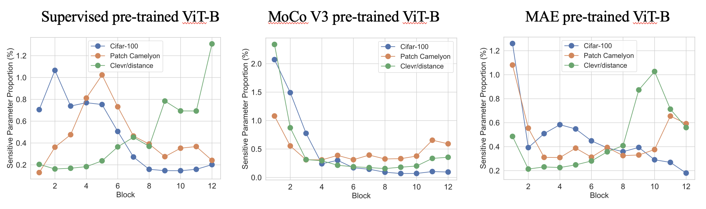
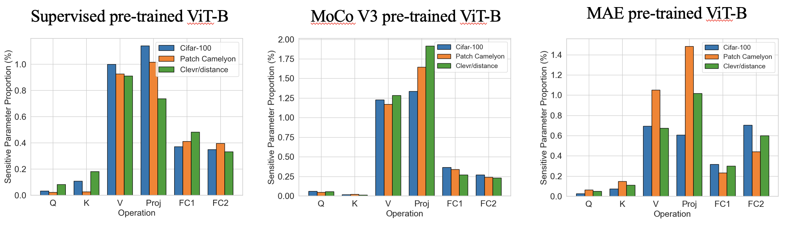
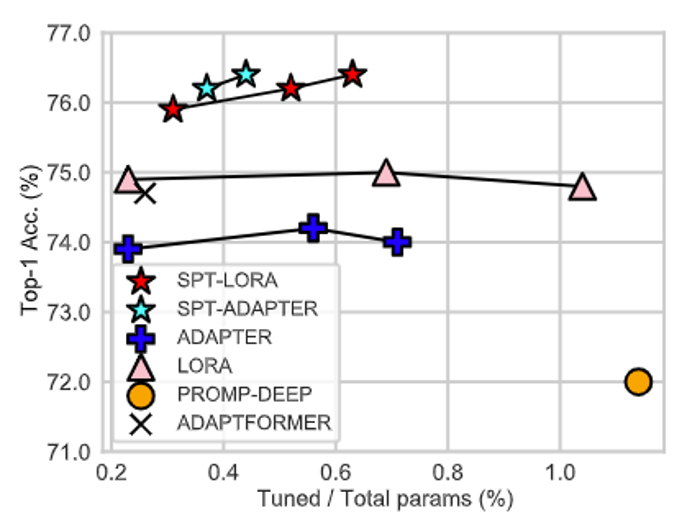

<h1 align="center">Sensitivity-Aware Parameter-Efficient Fine-Tuning</h1>

**[ICCV 2023] (oral) This is the official repository for our paper:** [Sensitivity-Aware Parameter-Efficient Fine-Tuning](https://arxiv.org/abs/2303.08566) by [Haoyu He](https://charles-haoyuhe.github.io/), [Jianfei Cai](https://jianfei-cai.github.io/), [Jing Zhang](https://scholar.google.com/citations?user=9jH5v74AAAAJ&hl=en), [Dacheng Tao](https://www.sydney.edu.au/engineering/about/our-people/academic-staff/dacheng-tao.html) and [Bohan Zhuang](https://bohanzhuang.github.io/).
***
><h3><strong><i>🚀 News</i></strong></h3>
>[2023-09-12]: Release code.
> 
>[2023-08-12]: Got accepted by ICCV 2023 for oral presentation!
> 
***
### Introduction:

Instead of presenting another architecture with learnable parameters in parameter-effcient fine-tuning (PEFT), our work emphasizes the importance to put PEFT architectures to optimal positions tailored for diverse tasks!


Our SPT consists of two stages. 

Stage 1 is a very **quick one-shot parameter sensitivity estimation** (several seconds) to find where to introduce trainable parameters. The following are some interesting sensitivity patterns in various pre-trained ViTs with top-0.4% sensitive parameters. We find that the proportions exhibit **task-specific varying patterns in terms
of network depth** and **task-agnostic similar patterns in terms of operations**.




Stage 2 is standard PEFT that keep the majority parameters frozen and only fine-tune the trainable ones. Our SPT introduces trainable parameters to the sensitive positions in two granularities: the unstructured neurons and structured PEFT modules (e.g., LoRA or Adapter) to achieve good performance! 



If you find this repository or our paper useful, please consider cite and star us!

```
@inproceedings{he2023sensitivity,
  title={Sensitivity-Aware Visual Parameter-Efficient Fine-Tuning},
  author={He, Haoyu and Cai, Jianfei and Zhang, Jing and Tao, Dacheng and Zhuang, Bohan},
  booktitle={ICCV},
  year={2023}
}
```

------


## Getting started on SPT:

### Install dependency:

We have tested our code on both Torch 1.8.0, and 1.10.0. Please install the other dependencies with the following code in the home directory:

```
pip install -r requirements.txt
```

#### Data preparation:

We provide training and inference code for our main benchmark VTAB-1k.

```
cd data/vtab-source
python get_vtab1k.py
```

PS: You may have to manually install Sun397. Please refer to [VTAB-1k](https://github.com/google-research/task_adaptation).

#### Download pre-trained models:

Please download the backbones with the following code:

```
cd checkpoints

# Supervised pre-trained ViT-B/16
wget https://console.cloud.google.com/storage/browser/_details/vit_models/imagenet21k/ViT-B_16.npz

# MAE pre-trained ViT-B/16
wget https://dl.fbaipublicfiles.com/mae/pretrain/mae_pretrain_vit_base.pth

# MoCo V3 pre-trained ViT-B/16
wget https://dl.fbaipublicfiles.com/moco-v3/vit-b-300ep/linear-vit-b-300ep.pth.tar
```

#### Get parameter sensitivity:

We have provided the following code (we have already provided the sensitivity for supervised pre-trained ViT-B/16 in `sensitivity_spt_supervised_lora_a10` and `sensitivity_spt_supervised_adapter_a10`).

```
# SPT-ADAPTER and SPT-LORA with supervised pre-trained ViT-B/16
bash configs/vtab_mae_spt_lora_sensitivity.sh
bash configs/vtab_mae_spt_adapter_sensitivity.sh

# SPT-ADAPTER and SPT-LORA with MAE pre-trained ViT-B/16
bash configs/vtab_mae_spt_lora_sensitivity.sh
bash configs/vtab_mae_spt_adapter_sensitivity.sh

# SPT-ADAPTER and SPT-LORA with MoCo V3 pre-trained ViT-B/16 
bash configs/vtab_mae_spt_lora_sensitivity.sh
bash configs/vtab_mae_spt_adapter_sensitivity.sh
```

#### PEFT with SPT:

We have provided the following training code:

```
# SPT-ADAPTER and SPT-LORA with supervised pre-trained ViT-B/16
bash configs/vtab_supervised_spt_lora.sh
bash configs/vtab_supervised_spt_adapter.sh

# SPT-ADAPTER and SPT-LORA with MAE pre-trained ViT-B/16
bash configs/vtab_mae_spt_lora.sh
bash configs/vtab_mae_spt_adapter.sh

# SPT-ADAPTER and SPT-LORA with MoCo V3 pre-trained ViT-B/16 
bash configs/vtab_moco_spt_lora.sh
bash configs/vtab_moco_spt_adapter.sh
```
PS: we sweep different trainable parameter budgets to seek potential better results (from 0.2M to 1.0M). 


#### TODO:

```
- [x] Release code for SPT on ViTs.
- [ ] Release code for FGVC benchmark training (ETA October).
- [ ] Release code for SPT on Swin (ETA October).
- [ ] Release code for SPT on ConvNext (ETA October).
- [ ] Integrate to [PEFT](https://github.com/huggingface/peft) package.
```

### Acknowledgements:
Our code is modified from [NOAH](https://github.com/ZhangYuanhan-AI/NOAH), [CoOp](https://github.com/KaiyangZhou/CoOp), [AutoFormer](https://github.com/microsoft/Cream/tree/main/AutoFormer), [timm](https://github.com/rwightman/pytorch-image-models), and [mmcv](https://github.com/open-mmlab/mmcv). We thank the authors for their open-sourced code.
